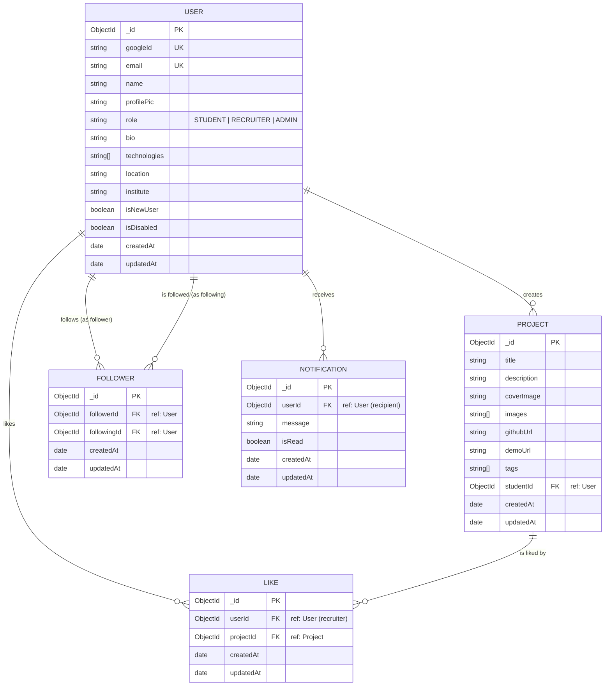
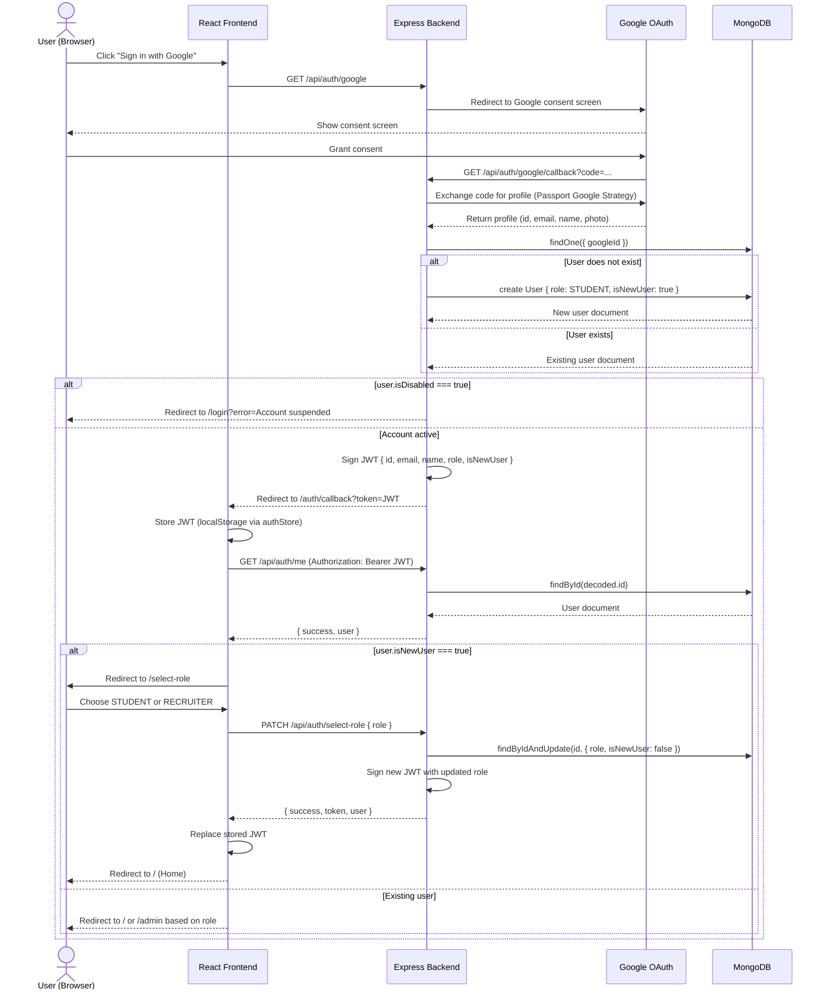
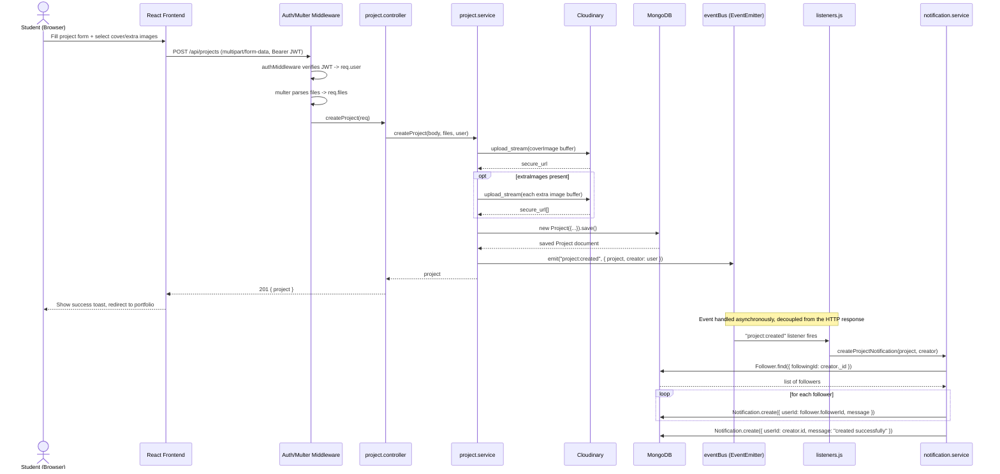
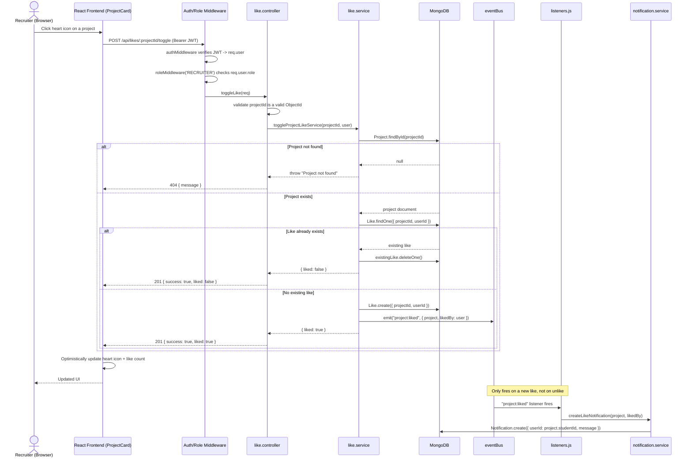

# System Documentation

## 1. Entity Relationship Diagram



### Notes on relationships

- **User → Project (1:N)**: `Project.studentId` references the owning `User`. A project always has exactly one owner.
- **User ↔ Project via Like (M:N)**: `Like` is a join collection. A compound unique index on `{ userId, projectId }` prevents a user from liking the same project twice.
- **User ↔ User via Follower (M:N, self-referencing)**: `Follower` is a join collection where both `followerId` and `followingId` reference `User`. A compound unique index on `{ followerId, followingId }` prevents duplicate follow records.
- **User → Notification (1:N)**: `Notification.userId` is the recipient. Notifications are created indirectly via events (project creation, likes, follows), not by direct user action.
- **Cardinality enforcement**: Mongoose schema-level `required: true` enforces FK presence; uniqueness on Like/Follower is enforced at the database index level, not just in application code, which protects against race conditions under concurrent requests.

---

## 2. Sequence Diagrams

### 2.1 OAuth Login Flow



### 2.2 Create Project Flow



### 2.3 Like Project Flow



---

## 3. API Documentation

**Base URL:** `{API_BASE}/api`
**Auth header (where required):** `Authorization: Bearer <JWT>`
**Standard error shape:** `{ "success": false, "message": "..." }` (or `{ "message": "..." }` on routes that predate the standardized error envelope — noted per route below)

### 3.1 Auth Routes — `/api/auth`

| Method | Path | Auth | Role |
|---|---|---|---|
| GET | `/google` | None | — |
| GET | `/google/callback` | None (Google redirect) | — |
| PATCH | `/select-role` | Bearer JWT | Any |
| GET | `/me` | Bearer JWT | Any |
| PUT | `/update-profile` | Bearer JWT | Any |

**GET `/google`**
Redirects the browser to Google's OAuth consent screen. No request body.

**GET `/google/callback`**
Handled by Passport + `handleGoogleCallback`. Not called directly by the frontend.
- Success: HTTP redirect to `{CLIENT_URL}/auth/callback?token=<JWT>`
- Disabled account: HTTP redirect to `{CLIENT_URL}/login?error=Account suspended. Please contact support.`

**PATCH `/select-role`**
Request body:
```json
{ "role": "STUDENT" }
```
`role` must be `"STUDENT"` or `"RECRUITER"`.

Response `200`:
```json
{
  "success": true,
  "token": "<new JWT>",
  "user": { "_id": "...", "email": "...", "name": "...", "role": "STUDENT", "isNewUser": false, "...": "..." }
}
```
Response `400`: `{ "success": false, "message": "Invalid role" }`

**GET `/me`**
No body/params.
Response `200`:
```json
{ "success": true, "user": { "_id": "...", "name": "...", "email": "...", "role": "...", "...": "..." } }
```
Response `404`: `{ "success": false, "message": "User not found" }`

**PUT `/update-profile`**
Request body:
```json
{ "name": "Jane Doe", "profilePic": "https://..." }
```
Response `200`:
```json
{ "success": true, "token": "<new JWT>", "user": { "...": "..." } }
```
Response `400`: `{ "success": false, "message": "Name is required" }`

---

### 3.2 User Routes — `/api/users`

| Method | Path | Auth | Role |
|---|---|---|---|
| PUT | `/profile` | Bearer JWT | Any |
| GET | `/:id` | Bearer JWT | Any |

**PUT `/profile`**
Updates extended profile fields (separate from `/auth/update-profile`, which only handles name/photo).
Request body:
```json
{
  "bio": "Full-stack developer...",
  "technologies": "React, Node.js, MongoDB",
  "location": "Colombo, Sri Lanka",
  "institute": "University of X"
}
```
`technologies` accepts either a comma-separated string or an array; it is normalized to an array server-side.

Response `200`: updated `User` document (no `__v` field).
Response `404`: `{ "message": "User not found" }`

**GET `/:id`**
Path param: `id` — target user's MongoDB `_id`.
Response `200`:
```json
{
  "user": {
    "name": "...", "email": "...", "profilePic": "...", "role": "...",
    "bio": "...", "technologies": ["..."], "location": "...", "institute": "...", "createdAt": "..."
  },
  "projects": [ { "...": "Project documents owned by this user" } ],
  "followerCount": 12
}
```
Response `404`: `{ "message": "User not found" }`

---

### 3.3 Project Routes — `/api/projects`

| Method | Path | Auth | Role |
|---|---|---|---|
| POST | `/` | Bearer JWT | Any (intended: STUDENT) |
| GET | `/` | None | — |
| GET | `/:id` | None | — |
| PUT | `/:id` | Bearer JWT | Owner only |
| DELETE | `/:id` | Bearer JWT | Owner only |

**POST `/`**
Content-Type: `multipart/form-data`

| Field | Type | Notes |
|---|---|---|
| `title` | string | required |
| `description` | string | required |
| `githubUrl` | string | optional |
| `demoUrl` | string | optional |
| `tags` | string | comma-separated, normalized to array |
| `coverImage` | file | max 1 |
| `extraImages` | file[] | max 10 |

Response `201`: created `Project` document.
Response `500`: `{ "message": "<error>" }`

**GET `/`**
Query params:

| Param | Type | Notes |
|---|---|---|
| `userId` | string | optional — filters to projects by a specific student |

Response `200`: array of `Project` documents, each populated with `studentId: { name, email, profilePic }`.

**GET `/:id`**
Response `200`: single `Project` document, `studentId` populated.
Response `404`: `{ "message": "Project not found" }`

**PUT `/:id`**
Content-Type: `multipart/form-data` — same fields as POST, all optional (only provided fields are updated). Only the project owner (`req.user.id === project.studentId`) may update.
Response `200`: updated `Project` document.
Response `403`: `{ "message": "Unauthorized" }`
Response `404`: `{ "message": "Project not found" }`

**DELETE `/:id`**
Response `200`: `{ "message": "Project deleted" }`
Response `403` / `404`: as above.

---

### 3.4 Like Routes — `/api/likes`

| Method | Path | Auth | Role |
|---|---|---|---|
| POST | `/:projectId/toggle` | Bearer JWT | RECRUITER |
| GET | `/:projectId/status` | Bearer JWT | RECRUITER |
| GET | `/:projectId/count` | Bearer JWT | Any |
| GET | `/my-likes` | Bearer JWT | RECRUITER |

**POST `/:projectId/toggle`**
No body. Toggles the authenticated recruiter's like on the target project.
Response `201`: `{ "success": true, "liked": true }` or `{ "success": true, "liked": false }`
Response `400`: `{ "success": false, "message": "Invalid project id" }`
Response `404`: `{ "success": false, "message": "Project not found" }`

**GET `/:projectId/status`**
Response `200`: `{ "success": true, "liked": true }`

**GET `/:projectId/count`**
Response `200`: `{ "success": true, "count": 17 }`

**GET `/my-likes`**
Response `200`:
```json
{ "success": true, "projects": [ { "...": "Project documents, populated with studentId" } ] }
```

---

### 3.5 Follow Routes — `/api/follows`

| Method | Path | Auth | Role |
|---|---|---|---|
| POST | `/:userId/toggle` | Bearer JWT | RECRUITER |
| GET | `/:userId/status` | Bearer JWT | RECRUITER |
| GET | `/:userId/count` | Bearer JWT | RECRUITER |
| GET | `/following` | Bearer JWT | RECRUITER |

**POST `/:userId/toggle`**
No body. `userId` is the target student being followed/unfollowed.
Response `201`: `{ "success": true, "following": true }` or `{ "success": true, "following": false }`
Response `400`: `{ "success": false, "message": "You cannot follow yourself" }` or `"Invalid user id"`
Response `404`: `{ "success": false, "message": "User not found" }`

**GET `/:userId/status`**
Response `200`: `{ "success": true, "following": true }`

**GET `/:userId/count`**
Response `200`: `{ "success": true, "count": 8 }`

**GET `/following`**
Response `200`:
```json
{ "success": true, "users": [ { "_id": "...", "name": "...", "email": "...", "profilePic": "...", "role": "..." } ] }
```

---

### 3.6 Notification Routes — `/api/notifications`

| Method | Path | Auth | Role |
|---|---|---|---|
| GET | `/` | Bearer JWT | Any |
| PUT | `/:id/read` | Bearer JWT | Any (owner only, enforced via query) |

**GET `/`**
Response `200`:
```json
{
  "success": true,
  "notifications": [
    { "_id": "...", "userId": "...", "message": "...", "isRead": false, "createdAt": "..." }
  ]
}
```
Sorted by `createdAt` descending.

**PUT `/:id/read`**
Marks a single notification as read. Scoped to `{ _id: req.params.id, userId: req.user.id }`, so a user cannot mark another user's notification as read.
Response `200`: `{ "success": true, "notification": { "...": "..." } }`
Response `404`: `{ "success": false, "message": "Notification not found" }`

---

### 3.7 Admin Routes — `/api/admin`

All routes require `Bearer JWT` + `role: ADMIN`.

| Method | Path |
|---|---|
| GET | `/users` |
| PUT | `/users/:id/toggle-status` |
| GET | `/projects` |
| DELETE | `/projects/:id` |

**GET `/users`**
Response `200`:
```json
{ "success": true, "count": 42, "data": [ { "...": "User documents" } ] }
```

**PUT `/users/:id/toggle-status`**
Flips `isDisabled` on the target user. An admin cannot disable their own account.
Response `200`: `{ "success": true, "message": "User disabled successfully", "data": { "...": "User" } }`
Response `400`: `{ "success": false, "message": "Cannot disable your own account" }`
Response `404`: `{ "success": false, "message": "User not found" }`

**GET `/projects`**
Response `200`:
```json
{ "success": true, "count": 120, "data": [ { "...": "Project documents, studentId populated" } ] }
```

**DELETE `/projects/:id`**
Response `200`: `{ "success": true, "message": "Project deleted successfully" }`
Response `404`: `{ "success": false, "message": "Project not found" }`

---

## Appendix: Known Gaps to Document in OWASP Compliance Report

These are implementation details worth explicitly calling out in your OWASP write-up rather than leaving unaddressed:

- JWT is stored in `localStorage` on the frontend (`axios.js`), which is vulnerable to exfiltration via XSS; an httpOnly cookie pattern with CSRF protection is the more secure alternative.
- `auth.middleware.js` trusts the JWT payload without re-checking `isDisabled` against the database per request, so a disabled user's existing token remains valid until expiry (7 days).
- No rate limiting is currently applied to `/api/auth/google`, like-toggle, or follow-toggle endpoints.
- No schema-level input validation library (e.g., Zod/Joi) is used beyond Mongoose's own field validators.